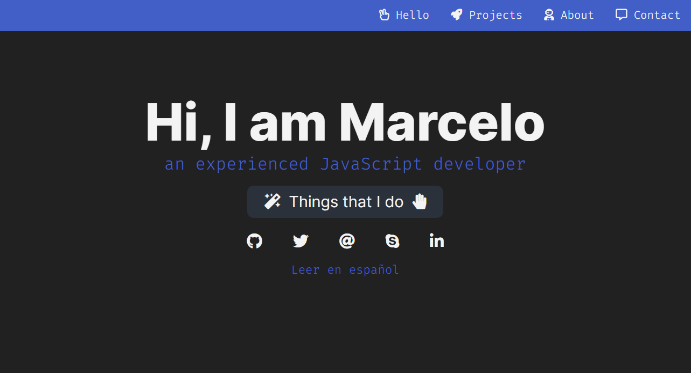

<h1 align="center">Portfolio.MarceloArias.com</h1>

 💡 Portfolio of projects and web applications made by me 😊

<a href="https://portfolio.marceloarias.com/">💻 Go to the website! 🚀</a>

    

## 🚀 Performance

### Desktop 💻

### Mobile 📲

