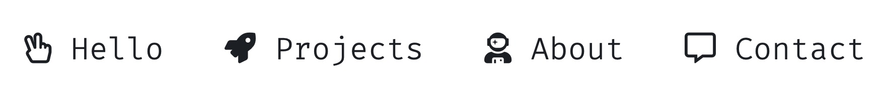
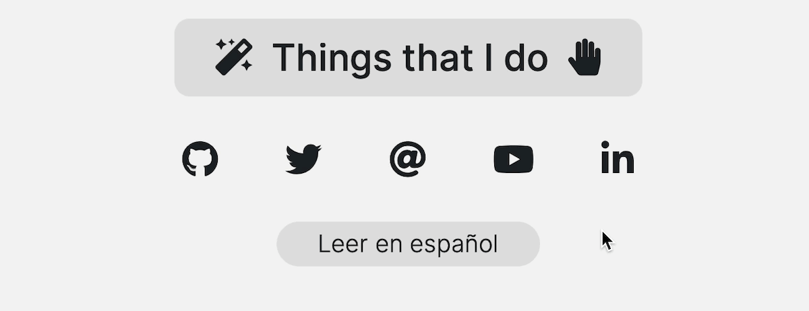
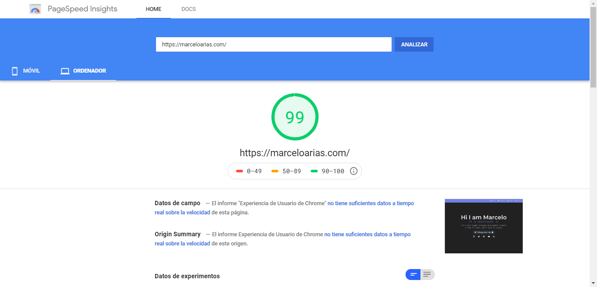
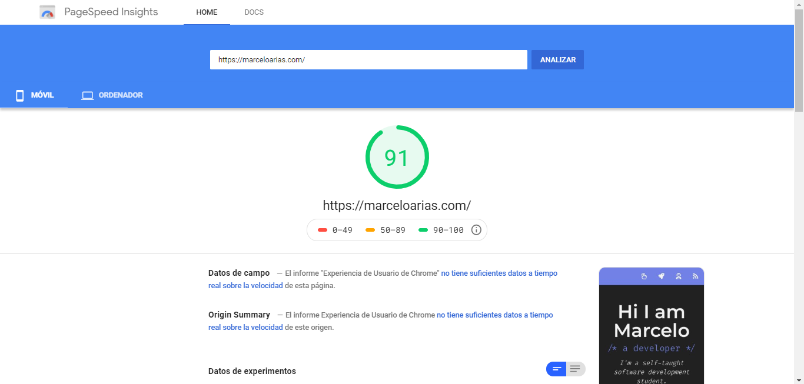

<h1 align="center">Portfolio.MarceloArias.com</h1>

<p align="center"> 💡 Portfolio of projects and web applications made by me 😊</p>
<p align="center"><a href="https://portfolio.marceloarias.com/">💻 Go to the website! 🚀</a></p>

<p align="center">
    <a href="https://github.com/360macky/me/actions/workflows/audit.yml"></a>
</p>


## 💻 Development

I built my portfolio without frameworks to keep it simple over time. An HTML file, and vanilla JavaScript files to handle language translation, and dark-light mode.

### 🤖 Page structure

My portfolio structure has the following sections: **Hello**, **Projects**, **About**, and **Contact**.



### 🔍 SEO

In order to have a better performance in search engines and in social networks, I have added OpenGraph tags like:

```html
<meta property="og:type" content="profile" />
<meta property="og:title" content="👨‍💻🚀 Marcelo Arias Portfolio" />
<meta property="og:url" content="https://portfolio.marceloarias.com/" />
<meta property="og:site_name" content="https://portfolio.marceloarias.com/" />
<meta
  property="og:description"
  content="I am Marcelo Arias, an expert JavaScript developer and this is my portfolio of projects."
/>
<meta property="og:image" content="https://portfolio.marceloarias.com/images/thumbnail/thumbnail.png" />
```

### 🌓 Dark/Light Theme

I have joined the wave of creating accessible websites in light and dark mode depending on the user's preferences. So in 2022 I updated my website to support both options.

I do this by editing the CSS global variables from JavaScript when a dark or light mode switch occurs.

By default, it is in dark mode for browsers that do not support this feature.

I verify that the theme is selected using `ifDarkThemeEnabled`.

```js
const ifDarkThemeEnabled = window.matchMedia('(prefers-color-scheme: dark)').matches;
```

In addition, I also update the theme-color tag, a tag that gives a characteristic color to the mobile address bar and in some browsers (such as Safari) also to the desktop address bar.

```js
if (ifDarkThemeEnabled) {
  document.getElementsByTagName('meta')['theme-color'].content = '#000000';
  document.documentElement.style.setProperty('--color-default', '#2a313a');
  ...
} else {
  document.getElementsByTagName('meta')['theme-color'].content = '#ffffff';
  document.documentElement.style.setProperty('--color-default', '#dddddd');
  ...
}
```

### 🌎 Internationalization

My portfolio is available in two languages English and Spanish. This language is chosen from the browser's language preference, but I added a button so that the user could choose the language of his preference.



## 🚀 Performance

### Desktop 💻



### Mobile 📲


